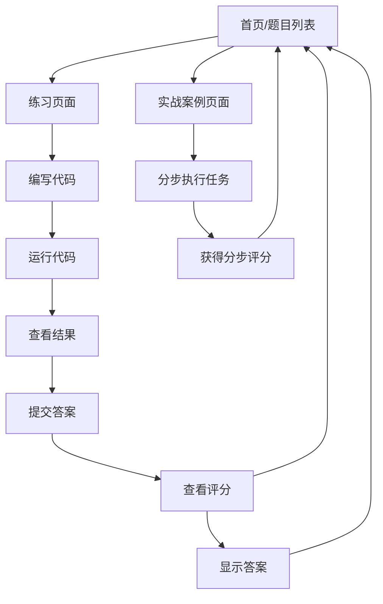

## 1. Product Overview
Pandas数据分析在线练习题网站，提供交互式学习平台，帮助用户通过实践掌握Pandas库的核心功能。
- 面向数据科学初学者和希望提升Pandas技能的开发者，提供系统化的练习环境
- 市场价值：填补在线Pandas实践学习资源的空白，提供结构化的学习路径和即时反馈

## 2. Core Features

### 2.1 User Roles
| Role | Registration Method | Core Permissions |
|------|---------------------|------------------|
| Normal User | No registration required | Access all practice problems, save progress locally |

### 2.2 Feature Module
1. **首页/题目列表页**：题目卡片网格、学习进度条、总得分显示
2. **练习页面**：题目描述、代码编辑器、运行结果输出、评分反馈
3. **实战案例页面**：分步数据分析案例、分步执行和评分

### 2.3 Page Details
| Page Name | Module Name | Feature description |
|-----------|-------------|---------------------|
| 首页/题目列表页 | 题目卡片网格 | 显示所有题目卡片，包含题号、题目名称、难度标签、得分状态 |
| 首页/题目列表页 | 学习进度条 | 显示总体学习进度和总得分 |
| 练习页面 | 题目描述区 | 显示题目描述、任务要求、可能用到的Pandas API提示 |
| 练习页面 | 代码编辑器 | 支持编写Python Pandas代码，提供语法高亮 |
| 练习页面 | 运行结果输出 | 显示代码执行结果，包括DataFrame输出 |
| 练习页面 | 评分反馈 | 提交答案后显示评分结果和反馈信息 |
| 练习页面 | 操作按钮 | 运行代码、提交答案、显示答案、返回列表 |
| 实战案例页面 | 分步任务 | 包含数据加载、清洗、探索、可视化、结论等步骤 |
| 实战案例页面 | 分步执行 | 支持分步执行代码并获得相应分数 |

## 3. Core Process
用户流程：
1. 用户访问首页，查看题目列表和学习进度
2. 点击题目卡片进入练习页面
3. 阅读题目描述和要求
4. 在代码编辑器中编写Pandas代码
5. 点击"运行代码"查看输出结果
6. 点击"提交答案"进行评分
7. 查看评分反馈，可选择"显示答案"查看参考答案
8. 点击"返回列表"回到首页
9. 对于实战案例，按照步骤执行并获得相应分数

## 4. User Interface Design
### 4.1 Design Style
- Primary color: #3b82f6 (蓝色)
- Secondary color: #10b981 (绿色)
- Accent color: #f59e0b (橙色)
- Button style: Rounded corners, subtle shadows, hover effects
- Font: Inter (sans-serif) for body, Space Mono (monospace) for code
- Layout style: Modern card-based layout with clean spacing
- Icon style: Lucide icons with consistent stroke width
- Animation: Subtle transitions, code editor syntax highlighting, result loading animations

### 4.2 Page Design Overview
| Page Name | Module Name | UI Elements |
|-----------|-------------|-------------|
| 首页/题目列表页 | 题目卡片网格 | 响应式网格布局，卡片包含题号、题目名称、难度标签（简单：绿色，中等：橙色，困难：红色）、得分状态（已完成：绿色打勾） |
| 首页/题目列表页 | 学习进度条 | 水平进度条显示完成百分比，总得分显示在右侧 |
| 练习页面 | 题目描述区 | 左侧边栏，包含题目标题、难度标签、任务描述、API提示 |
| 练习页面 | 代码编辑器 | 中间区域，CodeMirror或Monaco Editor，支持Python语法高亮，行号显示 |
| 练习页面 | 运行结果输出 | 右侧边栏，显示代码执行结果，包括DataFrame表格格式化显示 |
| 练习页面 | 评分反馈 | 右侧边栏下方，显示评分结果和反馈信息，包含成功/失败图标 |
| 练习页面 | 操作按钮 | 底部固定按钮栏，包含运行、提交、显示答案、返回按钮 |
| 实战案例页面 | 分步任务 | 左侧边栏显示步骤列表，当前步骤高亮显示 |
| 实战案例页面 | 分步执行 | 中间代码编辑器，右侧结果和评分区域 |

### 4.3 Responsiveness
- Desktop-first design with responsive breakpoints
- Mobile-adaptive layout: On smaller screens, the three-column layout (description, editor, results) becomes a single column with tabs
- Touch optimization: Button sizes and spacing adjusted for touch interfaces

### 4.4 3D Scene Guidance
Not applicable for this project.