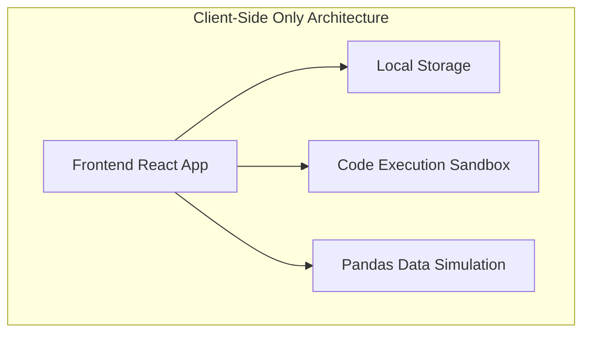
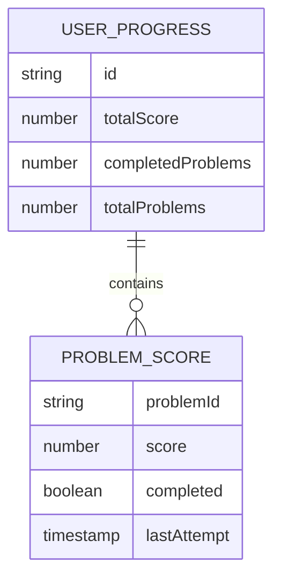

## 1. Architecture Design


## 2. Technology Description
- Frontend: React@18 + tailwindcss@3 + vite
- Initialization Tool: vite-init
- Backend: None (client-side only application)
- Data Storage: LocalStorage (for saving user progress and scores)
- Code Editor: CodeMirror 6
- Python Execution: Pyodide (WebAssembly-based Python runtime)
- Data Visualization: Matplotlib via Pyodide
- State Management: Zustand
- Routing: React Router DOM

## 3. Route Definitions
| Route | Purpose |
|-------|---------|
| / | Home page with problem list and progress |
| /problem/:id | Practice problem page |
| /case-study | Comprehensive case study page |

## 4. API Definitions
Not applicable for this client-side only application.

## 5. Server Architecture Diagram
Not applicable for this client-side only application.

## 6. Data Model
### 6.1 Data Model Definition


### 6.2 Data Definition Language
#### LocalStorage Schema
```javascript
// User progress object stored in localStorage
const userProgress = {
  totalScore: 0, // Total score across all problems
  completedProblems: 0, // Number of problems completed
  totalProblems: 11, // Total number of problems (10 + 1 case study)
  problemScores: [
    {
      problemId: "1", // Problem ID
      score: 10, // Score for this problem (max 10 per problem, 50 for case study)
      completed: true, // Whether the problem is completed
      lastAttempt: "2023-10-01T12:00:00Z" // Timestamp of last attempt
    },
    // More problem scores...
  ]
};
```

#### Problem Data Structure
```javascript
const problems = [
  {
    id: "1",
    title: "创建DataFrame并查看基本信息",
    difficulty: "easy",
    description: "创建一个包含学生信息的DataFrame，并查看其基本信息。",
    requirements: "1. 创建一个包含姓名、年龄、成绩的DataFrame\n2. 显示前5行数据\n3. 显示DataFrame的基本信息\n4. 显示DataFrame的形状",
    hints: ["pd.DataFrame()", ".head()", ".info()", ".shape"],
    testData: "{\"姓名\": [\"张三\", \"李四\", \"王五\"], \"年龄\": [18, 19, 20], \"成绩\": [85, 92, 78]}",
    expectedOutput: "...", // Expected output for validation
    solution: "..." // Reference solution
  },
  // More problems...
];

const caseStudy = {
  id: "case-study",
  title: "电商销售数据分析综合实战",
  difficulty: "hard",
  steps: [
    {
      id: "1",
      title: "数据加载与初步观察",
      description: "读取CSV数据并查看数据概况。",
      score: 10,
      testData: "...",
      expectedOutput: "...",
      solution: "..."
    },
    // More steps...
  ]
};
```